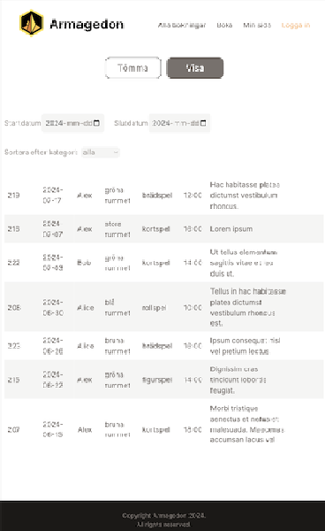

# Bokningssystem 

En enkelsidesapplikation (SPA) som är byggd med Next.js, React, TypeSctipt, Tailwind CSS och MySQL.

Bokningssystemet är ett system för att skapa bokningar (boka spelaktiviteter) som sparas i en MySQL-databas. Man kan se en översiktslista med alla bokade spelaktiviteter f.o.m. idag och 6 månader framåt, sortera bokningar efter datum och/ eller spelkategori.

Om man är inloggad så kan man göra en bokning, gå in på "Min sida" och se alla bokningar som man har skapat, hantera sina bokningar (t.ex. ta bort en bokning). 

Bokningsystemet har grundläggande funktioner och bra utvecklingsmöjligheter. 


## För att köra min application lokalt


#### (Det krävs MAMP, databaskopia som importeras med hjälp av phpMyAdmin och databaskonfiguration.)


1. Klona repo

```

git clone git@github.com:OlgaGustafsson/bokningssystem.git

```

2. Gå in i repokatalogen

```

cd bokningssystem

```

3. Installera dev dependencies

```

npm install

```

4. Starta servern 

```

npm run dev

```

5. Öppna http://localhost:3000/ i din webbläsare.


#

#



#